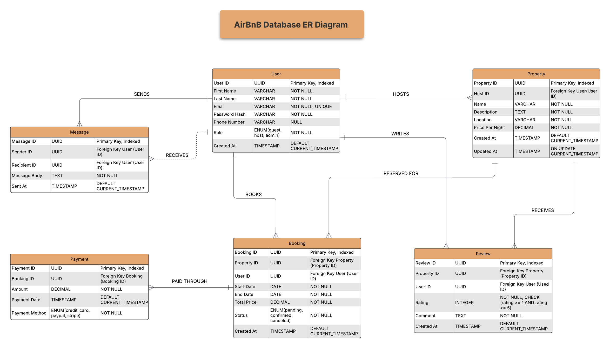

# AirBnB Database ER Diagram

This Entity-Relationship diagram represents the database structure for an AirBnB-like application. The diagram shows the following entities: User, Property, Booking, Payment, Review, and Message, along with their attributes and relationships.

Key relationships include:
- User HOSTS Property (one-to-many)
- User BOOKS Booking (one-to-many)
- Property is RESERVED FOR Booking (one-to-many)
- Booking is PAID THROUGH Payment (one-to-many)
- User WRITES Review (one-to-many)
- Property RECEIVES Review (one-to-many)
- User SENDS and RECEIVES Messages (dual one-to-many relationships)

